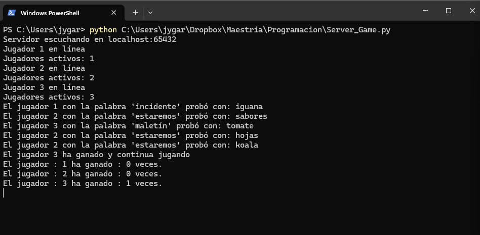
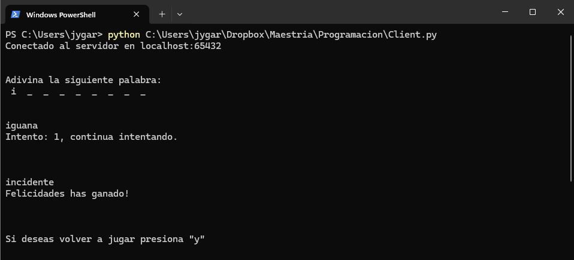
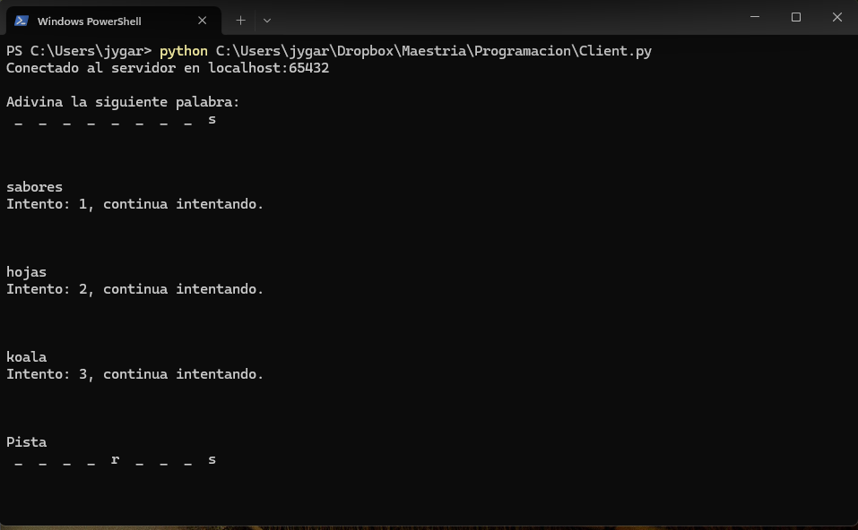
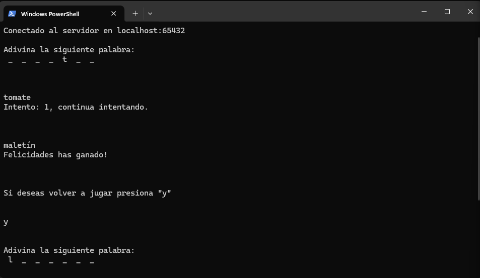

### Reporte de Desarrollo del Juego de Adivinanzas en Red

#### Introducción

El objetivo de este proyecto fue desarrollar un juego de adivinanzas en red utilizando sockets en Python. El juego consiste en un servidor que selecciona una palabra al azar y la envía a los clientes. Los clientes intentan adivinar la palabra enviando sus intentos al servidor, que proporciona pistas y lleva un registro de las puntuaciones de los jugadores. El juego continúa hasta que un jugador adivine la palabra correcta.

#### Desarrollo del Proyecto

##### 1. Configuración del Entorno
Para desarrollar esta solución, se utilizó Python 3, aprovechando las bibliotecas `socket` y `threading` para la comunicación en red y la gestión de múltiples clientes, respectivamente.

##### 2. Implementación del Servidor

El código del servidor se encarga de:

- Seleccionar una palabra al azar de una lista predefinida.
- Esperar conexiones de clientes.
- Recibir intentos de los clientes.
- Proporcionar pistas basadas en los intentos.
- Mantener un registro de las puntuaciones de los jugadores.

##### 3. Implementación del Cliente

El código del cliente se encarga de:

- Conectarse al servidor.
- Enviar intentos de adivinanza.
- Recibir pistas y resultados del servidor.

#### Ejecución y Evidencia

##### Ejecución del Servidor

A continuación se muestra una imagen con la ejecución del servidor, en ella se puede observar la notificación cuando se conecta un jugador, posteriormente muestra el intento del jugador y la palabra que se le ha asignado además al ganar un jugador muestra los puntos de todos los jugadores conectados.

##### Ejecución del Cliente
###### Jugador 1:
Se muestra la interfaz inicial como cliente, y el caso en el que se equivoca en su primer intento y en el segundo acierta.

###### Jugador 2:
Se muestra la interfaz inicial como cliente, y el caso en el que se equivoca tres veces por lo que recibe una pista.

###### Jugador 3:
Se muestra la interfaz inicial como cliente, y el caso ha ganado y decide continuar por lo que se le brinda una nueva palabra para adiviniar.

#### Conclusiones

El juego de adivinanzas en red se implementó con éxito utilizando sockets en Python. La estructura modular del código permite manejar múltiples clientes de manera concurrente, proporcionando una experiencia de juego fluida. Este proyecto no solo refuerza el conocimiento en programación de redes, sino que también demuestra el uso efectivo de las bibliotecas `socket` y `threading` para desarrollar aplicaciones interactivas.

#### Código en GitHub
El código completo del proyecto puede ser revisado en el siguiente enlace de GitHub:
[Repositorio GitHub](https://github.com/JardiGarci/Proped-utico-de-Programaci-n/tree/main)

#### Referencias

-	J. Hunt, Advanced Guide to Python 3 Programming, Switzerland: Springer Cham, 2023. 
